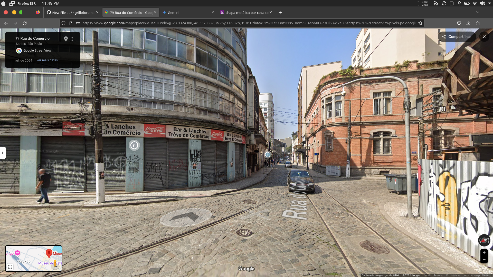

## REAL

A vida voce consegue perceber, o tempo tudo, como andy warrol, a questao voce nao é designer, talvez
nunca criara algo, mais tem percepcao que tudo muda, e algo alem nao somente perceber, algo como
quem viveu, como vai usar isso algum dia... conheci uma garota, ela viveu, viajou, foi em praia
grande, local que tenho interesse de conhecer, o que isso significa!!! Como isso impacta na vida, ou
algo além!!! ALguns dizem que cada pessoa é unica e tem suas caracteristicas e sua forma de observar.
As pessoas em grande maioria com essas redes sociais, tem sua importancia de babacologia, nao eram 
ninguem, no maximo alguem que seila, a maneira, muito do que existe independente sao pessoas altamente
agaradas ao social, familia, chatas com pensamentos do que acham e nao possuem validade alguma

